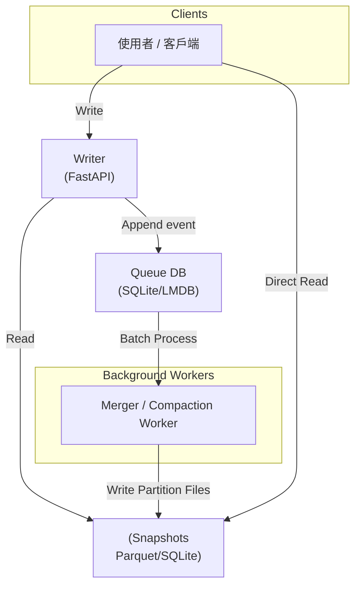

# 專案追蹤資料快取系統： 多讀單寫的資料架構設計紀錄  

## 1. 問題背景

- 產業：CG, VFX
- **目的是減少訪問SG/FPT的次數，重複使用資料，而非追求速度**
- column通常不超過50  
- 寫入頻率：200 人 × 每天約 100 筆 → **20,000 writes / day**  
- 讀取則預估約寫入的 10 倍 → **200,000 reads / day**  
- 使用情境：
  - 專案結束後可丟棄或單獨備份  
  - **寫少讀多**  
  - 想要**最低**維護成本（人力、硬體、知識負擔）

## 2. 目標
- Python生態系
- 能Relational searching
- 不host DB
- 可依日期 / 專案歸檔
- 單writer與多reader並行  
- 崩潰後能快速復原，復原後自動重試任務隊列
- 在NFS上存放快照，出錯時直接讀取快照應急

---

## 3. Tech stack選擇

### Writer
| 技術 | 優點 | 缺點 |
|------|------|------|
| **FastAPI** | async、auto-doc、pydantic validation、生態成熟 | 稍重（uvicorn + deps） |
| **Litestar** |  async、auto-doc、plugin system、type hints | 生態較新 |
| **http.server + custom handler** | 自由度高 | 開發運維成本也高 |
| **Deadline worker** | 現成、開發運維成本近乎於零 | 不夠可靠 |

### Database

| 技術 | 優點 | 缺點 | 適合用途 |
|------|------|------|---------|
| **SQLite** | 單寫多讀、成熟、簡單 | 寫入阻塞（但量不大可接受） | 日檔 or 小型 transactional |
| **DuckDB + Parquet** | 超快查詢、免載整檔 | 不適合多 writer | 分析查詢、多 reader |
| **LMDB** | 超快讀、多 reader、單 writer | 嚴格單 writer，寫入可能 block | queue、metadata |
| **Redis (AOF)** | 又快又簡單又好維護  | 不能SQL | 純key-value，不需要關聯性搜索 |
| **PostgresSQL** | 功能完整強大 | 維運成本 | 更複雜的情境 |

Writer API候選方案:
- **FastAPI**
- **Deadline worker**

資料庫候選方案：
- **DuckDB**
- **Parquet**
- **SQLite**

任務隊列候選方案:
- **SQLite**
- **LMDB**
- **Deadline內建**

---

## 4. 架構總覽
- Writer 採「事件 append-only」寫入（如 WAL/queue）
- 後端負責合併資料與產生日檔/parquet/db
- Reader 讀的是 **已封存的穩定檔案**（immutable file）
- Writer 當掉時可重跑 queue，或讀 snapshot 繼續寫



---

## 5. 檔案分割策略  
✔ 可做 **按日期** 或 **按專案** 分檔  
✔ Writer 只寫「當天」或「當前專案」  
✔ Reader 可讀所有檔案（通常是只讀且並行度高）

---

## 6. 背景 Queue / WAL 設計

Writer 收到資料後：

1. append event → queue（例如 SQLite / LMDB）  
2. 回應 client（不必等資料合併）  
3. 背景 worker 定期將 queue 事件 **merge 成 Parquet**  
4. 清除已處理事件  

等同 event sourcing + compaction：

> 單寫、多讀、高穩定性的 event-based architecture

---

## 7. 崩潰復原策略

### Writer 崩潰
- queue（SQLite/LMDB）是 ACID  
- 重啟之後 worker 讀 queue 裡尚未 processed 的事件重新跑  
- 不會遺失資料  

### Worker 崩潰
- 不影響 writer  
- compaction 沒跑完下次重啟再跑  
- snapshot（Parquet/SQLite）仍有效  

### Snapshot / NFS 備援
- 定時 copy parquet 到 NFS  
- API 掛掉 → 客戶端 switch 到 **直接讀 NFS**  
- parquet 支持 predicate pushdown → 不需讀整檔  

---

## 8. 範例代碼

### 快取服務出問題時，客戶端直接讀檔

#### DuckDB client read 示例

```python
import duckdb

con = duckdb.connect()
df = con.execute("""
    SELECT * 
    FROM 'nfs/projects/*.parquet'
    WHERE project_id = 123
""").df()
```

---

### SQLite queue schema
```sql
CREATE TABLE queue (
    id INTEGER PRIMARY KEY AUTOINCREMENT,
    event JSON,
    ts TIMESTAMP DEFAULT CURRENT_TIMESTAMP,
    processed INTEGER DEFAULT 0
);
```

### FastAPI append event
```python
from fastapi import FastAPI
import sqlite3, json

app = FastAPI()
conn = sqlite3.connect("queue.db", check_same_thread=False)

@app.post("/write")
def write_event(event: dict):
    conn.execute("INSERT INTO queue (event) VALUES (?)", 
                 [json.dumps(event)])
    conn.commit()
    return {"status": "ok"}
```

---

### 背景 Worker（合併到 Parquet）

```python
import sqlite3, duckdb, json
from pyarrow import Table
import pyarrow.parquet as pq

def process_queue():
    conn = sqlite3.connect("queue.db")
    cur = conn.execute("SELECT id, event FROM queue WHERE processed = 0")

    rows = [{"id": r[0], **json.loads(r[1])} for r in cur.fetchall()]
    if not rows:
        return

    # 轉成 Parquet
    table = Table.from_pylist(rows)
    pq.write_table(table, "data/day_2025_02_17.parquet", append=True)

    ids = [r["id"] for r in rows]
    conn.execute(
        f"UPDATE queue SET processed=1 WHERE id IN ({','.join(map(str, ids))})"
    )
    conn.commit()
```

---

### LMDB 作為 Queue 的範例

```python
import lmdb, json, time

env = lmdb.open("queue.lmdb", map_size=1e9)

def enqueue(event):
    with env.begin(write=True) as txn:
        key = str(time.time_ns()).encode()
        txn.put(key, json.dumps(event).encode())
```

---

## 9. 最終選擇

### 最低維運、最高可靠、讀寫模式最適配：

### Writer
- FastAPI 
- 單一 writer process → 追加事件到 Queue  

### Queue
- SQLite 
- 追求效能再用 LMDB  

### Background Worker
- 定期將 queue → Parquet  
- 分日期/專案產檔  

### Reader
- 客戶端可以直接讀 parquet + DuckDB  
- 或經 API 查詢  

### Failover
- queue ACID 保證不遺失  
- parquet snapshot 放 NFS  
- API 掛掉讀 snapshot 仍可運作  

---

